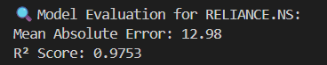
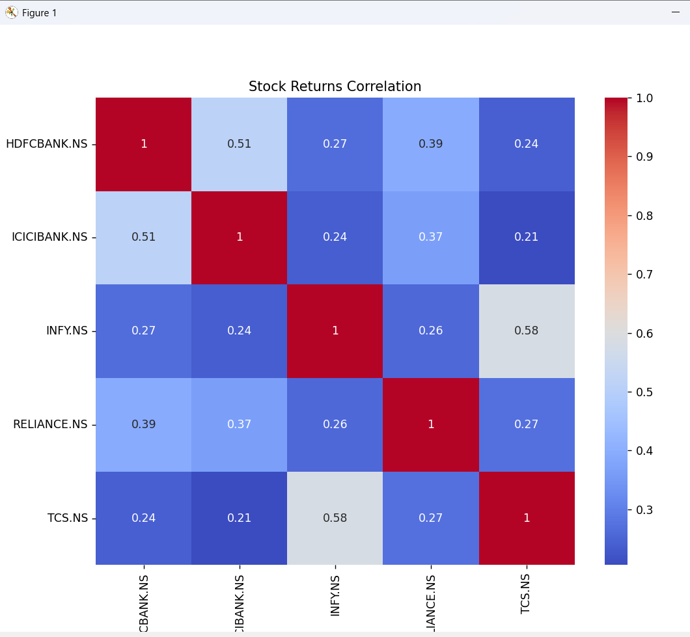
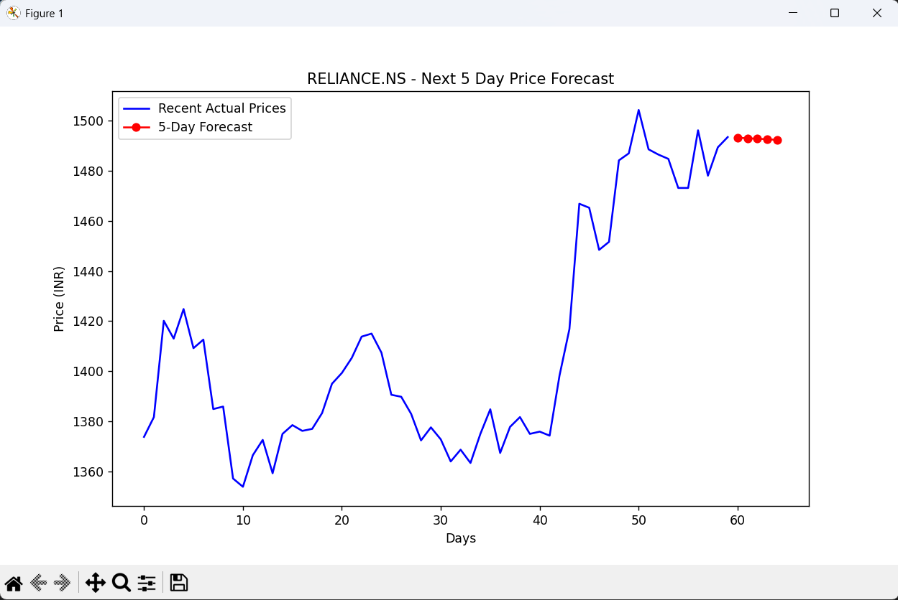

# 📊 Stock Market Prediction & Analytics System

An end-to-end **data-driven stock prediction project** that combines **financial analytics, data engineering, and machine learning** to predict the future closing prices of top Indian companies like **Reliance, TCS, Infosys, HDFC Bank, and ICICI Bank**.  

This project provides a complete workflow — from **data collection to predictive modeling and visualization** — serving as a foundation for **algorithmic trading, portfolio management**, and **financial data science** applications.
## 🚀 Project Overview

The **Stock Market Prediction & Analytics System** is designed to:
- Analyze **10 years of stock price data**
- Extract features like **moving averages, daily returns, and volatility**
- Predict **future closing prices** using **Linear Regression**
- Generate a **5-day price forecast**
- Visualize trends, correlations, and model performance

The system achieves an impressive **97.53% accuracy (R² Score)** and offers clear visual and analytical insights into stock behavior.

---

## 🧠 Key Features

✅ **Automated Data Fetching**  
Fetches 10 years of daily stock data using the **Yahoo Finance API** and saves it locally for reuse.  

✅ **Feature Engineering**  
Generates financial indicators such as:  
- **MA5, MA10, MA14, MA30** – Moving averages for trend detection  
- **Volatility** – Rolling standard deviation of returns  
- **Daily Returns** – Percent change between consecutive days  

✅ **Machine Learning Model**  
Trains a **Linear Regression** model to predict the **next day’s closing price** with:  
- **Mean Absolute Error (MAE): ~12.9**  
- **R² Score: 0.9753 (97.5% accuracy)**  

✅ **5-Day Price Forecast**  
Predicts future stock prices for the **next 5 trading days** using an iterative rolling-window approach.  

✅ **Financial Data Analytics**  
Includes correlation analysis, price trend visualization, and volatility measurement.
## 🧠Tech Stack

**Data Handling:**	pandas, numpy

**Data Source:**	yfinance

**Visualization:**	matplotlib, seaborn

**Machine Learning:**	scikit-learn

**Utility:**	os, datetime
## Installation

1. Clone the Repository

```bash
git clone https://github.com/shashwatkul/Stock-Market-Trend-Prediction-Dashboard.git
cd Stock-Market-Trend-Prediction

```
2. Create a Virtual Environment
```bash
python -m venv venv
venv\Scripts\activate       # on Windows
source venv/bin/activate    # on macOS/Linux
```
3. Install Dependencies
```bash
pip install -r requirements.txt
```
4. Run the Script
```bash
python stock_analysis.py
```

    
## 📊 Model Performance

✅ **Mean Absolute Error (MAE):**	12.98

✅ **R² Score (Accuracy):**	0.9753

✅ **Model:**	Linear Regression



## 📈 Visualizations

**1️⃣ Stock Price Trends (2015–2025)**

Visualizes 10-year closing price movements for top Indian stocks.


**2️⃣ Correlation Heatmap**

Displays how stock returns move relative to one another — helpful for portfolio diversification.


**3️⃣ Actual vs Predicted Prices**

Compares model predictions with real closing prices for accuracy evaluation.


**4️⃣ Future Forecast (Next 5 Days)**

Plots predicted prices for the next 5 trading days.

 
